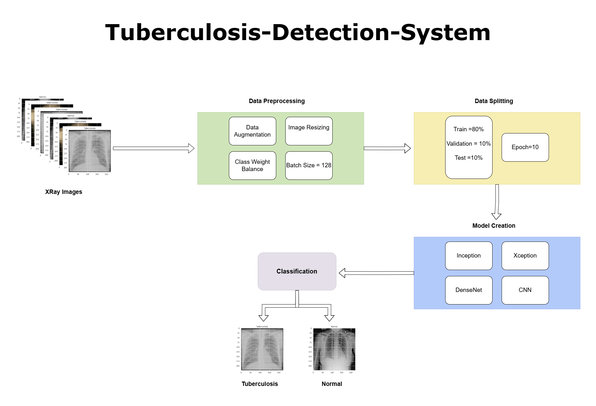

# Tuberculosis-Detection-System
---

## Repository Link

[https://github.com/SouvickC/Tuberculosis-Detection-System]

## Description

[Tuberculosis (TB) remains a significant global health threat, particularly in low-resource settings where early and accurate detection is critical for controlling its spread and improving patient outcomes. Traditional methods such as sputum microscopy are slow and often ineffective for patients with low bacterial loads, while manual interpretation of chest X-rays depends on experienced radiologists and is susceptible to delays and errors. Even existing computer-aided diagnosis systems have not achieved sufficient accuracy. As a result, there is an urgent need for advanced automated solutions that can rapidly and reliably detect TB from medical images. The aim of this work is to develop an automated TB detection system using deep learning, specifically binary classification of chest X-ray images to distinguish between normal and TB-positive cases. The study utilizes a chest X-ray dataset from Kaggle, resizing images to 224 by 224 pixels and employing data balancing and augmentation techniques to address class imbalance and improve robustness. Deep learning models, particularly convolutional neural networks, are chosen for their ability to extract complex patterns from images, offering a promising approach for highly accurate, automated medical diagnoses.
]

### Task Type

[Image Classification]

### Results Summary

- **Best Model:** [XceptionNet]
- **Evaluation Metric:** [Accuracy, Precision, Recall, F1-Score]
- **Result:** [96.95% accuracy, 97% Precision, 96% Recall, 97% of F1-Score]

## Documentation

1. **[Literature Review](0_LiteratureReview/README.md)**
2. **[Dataset Characteristics](1_DatasetCharacteristics/EDA_TB_Dataset.ipynb)**
3. **[Baseline Model](2_BaselineModel/baseline_model.ipynb)**
4. **[Model Definition and Evaluation](3_Model)**
5. **[Presentation](4_Presentation/ML_PPT.pptx)**

## Cover Image

